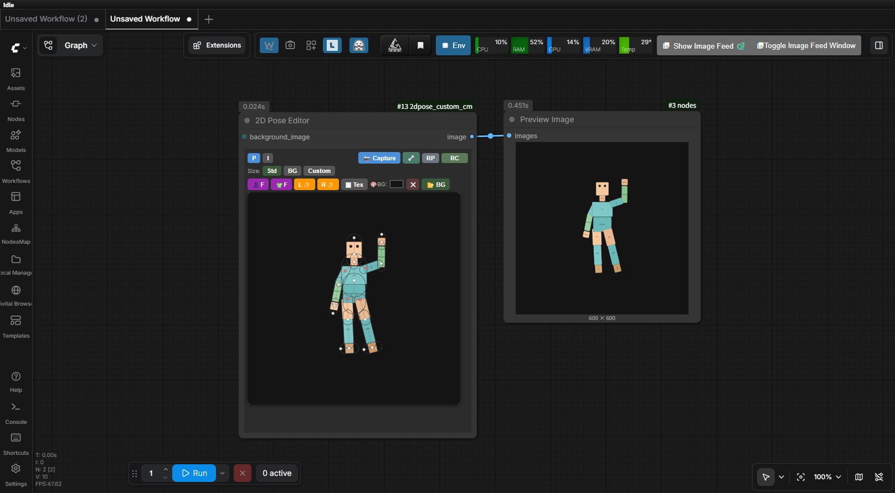

# ComfyUI 2D Pose Editor Node

A ComfyUI custom node that embeds an interactive 2D rigging figure directly inside the node.
Drag joints to pose the figure, then capture it as an `IMAGE` output.

ノード内で 2D リギングフィギュアをドラッグしてポーズを編集し、`IMAGE` として出力する ComfyUI カスタムノードです。


---



---

## Features / 機能

- 🦴 **Full body rigging** — head, neck, chest, abdomen, arms, hands, legs, feet
- 👁️ **Eye control** — drag the pupils to move the gaze direction
- 🎥 **Camera control** — pan (drag background) and zoom (mouse wheel) with reset
- 🖼️ **Texture atlas** — load a single PNG to skin all body parts via UV mapping (L/R separated UVs)
- 👤 **Head toggle** — switch between front face and back of head
- 👕 **Body toggle** — switch between front and back torso
- ✊ **Hand toggle** — switch each hand between open and closed (viewer perspective)
- 👁️‍🗨️ **Rig visibility** — show/hide skeleton overlay with stadium-shape outlines
- 📸 **One-click capture** — saves the current pose as a PNG image (always rig-free output)
- 🔄 **Reset pose** — return to the default pose instantly
- 🖼 **Background compositing** — connect a background `IMAGE` to composite the pose over it
- 📂 **Image Input Mode** — switch the node to image loader mode (P/I toggle), supports drag & drop
- 📐 **Output size mode** — Standard / Background / Custom width×height
- 🎨 **Background color picker** — set a solid background color; `✕` button clears it to transparent
- 📂 **Background image loader** — load a local image file as background; `✕` button clears it
- 🖼️ **Aspect ratio overlay** — frame overlay shows the exact output region for Background / Custom modes
- ✂️ **Aspect-correct capture** — captured image is cropped to the active frame (correct W×H output)

---

## Installation / インストール

### Option A: Clone into custom_nodes

```bash
cd ComfyUI/custom_nodes
git clone https://github.com/ketle-man/comfyui-2dpose-editor.git
```

### Option B: Manual

1. Download this repository as a ZIP and extract it
2. Place the `2dpose_custom_cm` folder inside `ComfyUI/custom_nodes/`
3. Restart ComfyUI

---

## Usage / 使い方

1. In ComfyUI, right-click the canvas → **Add Node** → **2D Pose** → **2D Pose Editor**
2. Drag the **white dots** (joints) to pose the figure
3. Drag the **black pupils** to change the eye direction
4. Use the toggle buttons to switch head / body / hand appearance
5. Optionally load a custom texture via **🖼 Tex**
6. Click **🦴** to toggle skeleton overlay visibility before capturing
7. Click **📸** (Capture) to save the current frame
8. Click **Queue Prompt** — the node outputs the pose as an `IMAGE`
9. Click **RP** (Reset Pose) to return to the default pose / **RC** (Reset Camera) to restore the view

### Image Input Mode

- Click the **I** button to switch to image loader mode
- Click **📂** to load a local image file, or **drag & drop** an image onto the node
- The loaded image is passed directly as the node output
- Click **P** to return to pose editor mode

### Background Color & Image

- **🎨 BG color picker** — sets a solid fill color behind the pose (default `#e0e0e0`)
  - Click **✕** next to the picker to go transparent (useful when `background_image` is connected)
- **📂 BG button** — loads a local image file as the background layer; displays letterboxed to fit the canvas
  - Click **✕** next to the BG button to clear the loaded image

### Output Size

- **Std** — use the canvas render size (600×600)
- **BG** — match the aspect ratio of the loaded background image (or connected `background_image`)
- **Custom** — specify width × height manually
- An overlay darkens the area outside the active output frame so you can see exactly what will be captured

### Camera controls

| Operation | Action |
|-----------|--------|
| Drag background | Pan the camera |
| Mouse wheel | Zoom in / out |
| 🎥 Reset Camera | Return to default view |

### Control points

| Dot | Behavior |
|-----|----------|
| White dot (joint) | Rotate the bone |
| Red dashed line (shoulder / hip) | Rotate + slide (change length) |
| Black dot (pupil) | Move eye gaze direction |
| Yellow ring | Currently selected / dragging |

### Texture Atlas

The node supports a **single sprite-sheet image** (texture atlas) for skinning all body parts.
UV coordinates are based on a **1024×1024** reference layout, but any image size is accepted —
UV coordinates scale automatically to match the loaded image.

Use `generate_atlas_template.html` to export a colored 1024×1024 template PNG with
stadium-shape outlines and direction annotations — paint your character parts over each region.
Use `generate_sample_atlas.html` to preview how the sample figure looks with your atlas.

**Atlas layout:**

| Row | Parts | Y offset |
|-----|-------|----------|
| 1 | head, neck, chest, abdomen | 0 |
| 2 | armL/R, foreArmL/R, handClosedL/R, handOpenL/R, footL/R | 180 |
| 3 | legL/R, shinL/R | 370 |
| 4 | headBack, chestBack, abdomenBack | 610 |

Left (L) and Right (R) UV regions are separate, allowing asymmetric textures and correct limb mirroring.

---

## Node Spec / ノード仕様

| Item | Value |
|------|-------|
| Node name | `PoseEditor2D` |
| Display name | `2D Pose Editor` |
| Category | `2D Pose` |
| Input (required) | `image_data` (STRING, hidden), `output_size_mode`, `custom_width`, `custom_height` |
| Input (optional) | `background_image` (IMAGE) |
| Output | `IMAGE` — shape `(1, H, W, C)`, float32 torch tensor |

---

## File Structure / ファイル構成

```
2dpose_custom_cm/
├── __init__.py                   # Node registration, WEB_DIRECTORY
├── pose_editor_node.py           # Backend: base64 PNG → IMAGE tensor
├── js/
│   └── pose_editor.js            # Frontend: ComfyUI extension + rigging logic
├── index_v2.html                 # Standalone reference HTML (v0.2.0 features)
├── generate_atlas_template.html  # Tool: export 1024×1024 UV template PNG
└── generate_sample_atlas.html    # Tool: export sample figure texture atlas
```

---

## Changelog

### v1.2.0
- Background color picker (`🎨 BG:`) with `✕` button to clear to transparent
- Background image loader (`📂 BG`) with `✕` button to clear; displayed with letterbox (aspect preserved)
- Aspect ratio frame overlay: darkens area outside active output region for Background / Custom modes
- Capture crops to the active frame — output image has correct W×H (no post-process stretch)
- Image Input Mode preview fixed: letterbox display, `cvsWrapper` hidden together to prevent node overflow

### v0.4.0
- Capture always outputs rig-free image (temporarily hides rig during capture)
- Image Input Mode: drag & drop support for loading images
- Rig overlay now draws stadium-shape outlines for each bone
- Body proportion improvements: wider chest/abdomen, larger hands/feet
- Joint gap fixes: added texOffset to arms, increased foot overlap
- Dummy atlas colors updated to realistic skin/cloth/shoe tones
- Atlas template generator rewritten with colored fills, stadium outlines, direction annotations, and live preview
- Bone parameters synced across pose_editor.js, generate_sample_atlas.html, generate_atlas_template.html

### v0.3.0
- Background compositing (`background_image` optional input)
- Image Input Mode (P/I toggle) — node acts as image loader
- Output size mode: Standard / Background / Custom
- Left/Right separated UVs for all limbs (armL/R, foreArmL/R, handL/R, legL/R, shinL/R, footL/R)
- Joint gap fix: stadium-shape clip + `texOffset` overlap per bone
- Hand/foot orientation corrected (fingers and toes face outward)
- Compact UI: mode row, size row, parts row; canvas at 80% scale
- Atlas layout reorganized (no overlapping UV regions)
- `generate_sample_atlas.html` and `generate_atlas_template.html` fully updated

### v0.2.0
- Camera pan and zoom with reset button
- Texture atlas support (UV-based, auto-scales to image size)
- Head front/back, body front/back, hand open/close toggles
- Rig / control point show-hide toggle (reflected in capture output)
- Fixed texture orientation per bone (`flipTex` flag)
- Load Texture button (English label, custom file picker)
- Added atlas template and sample atlas generator tools

### v0.1.0
- Initial release: full body rigging inside a ComfyUI node
- Eye gaze control, capture, reset

---

## Requirements / 動作環境

- [ComfyUI](https://github.com/comfyanonymous/ComfyUI)
- Python 3.10+
- `torch`, `Pillow`, `numpy` (included with ComfyUI)

---

## License

MIT License
